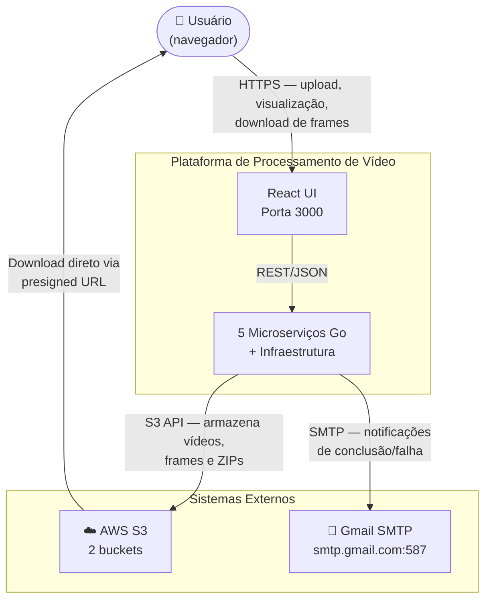
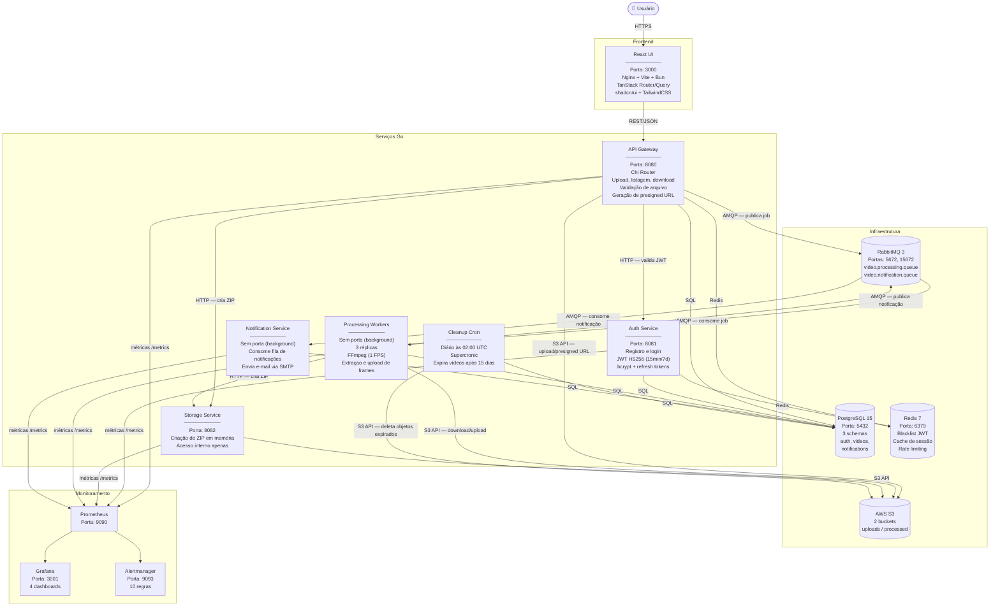
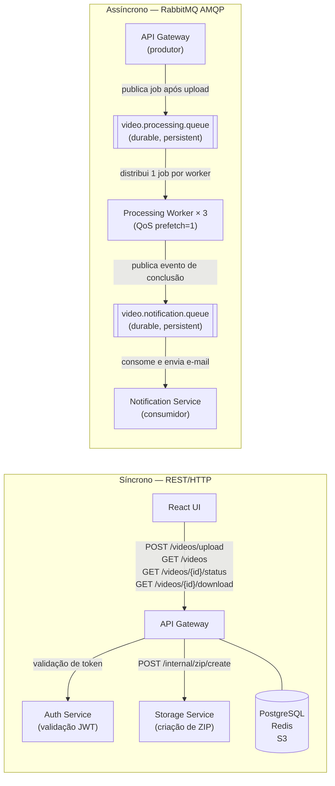
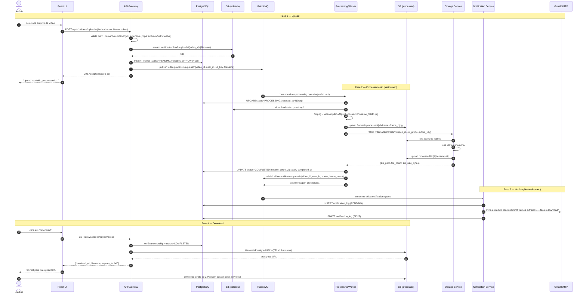
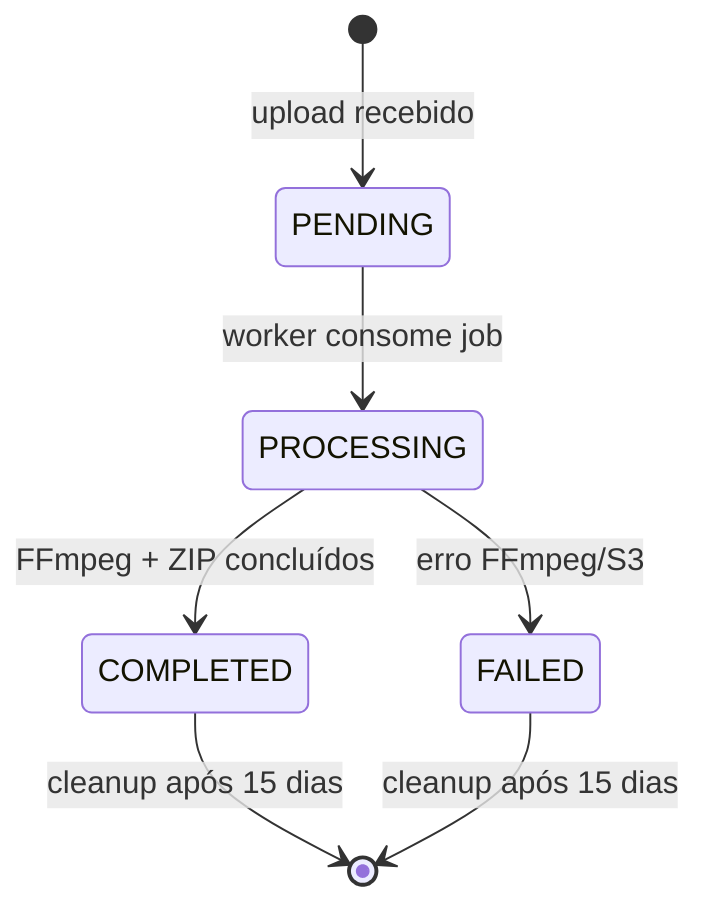
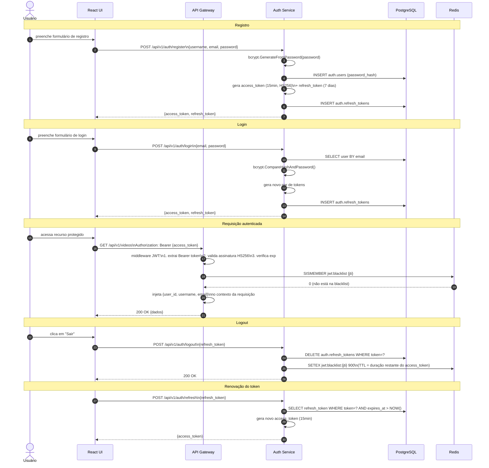
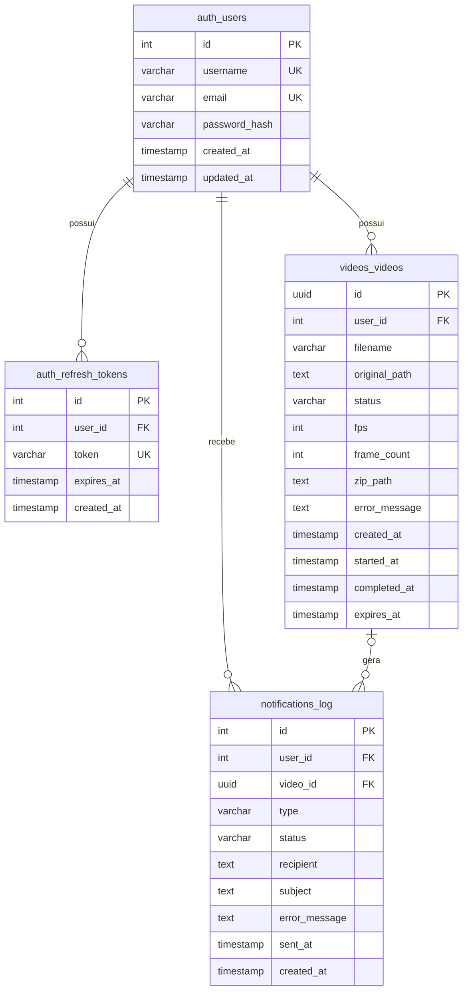
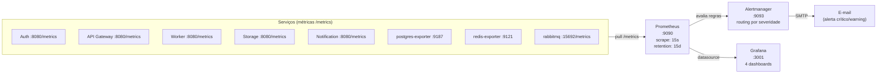
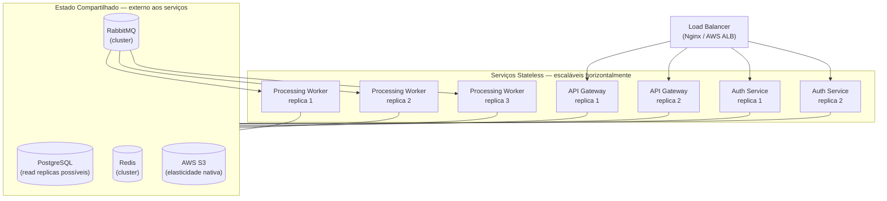
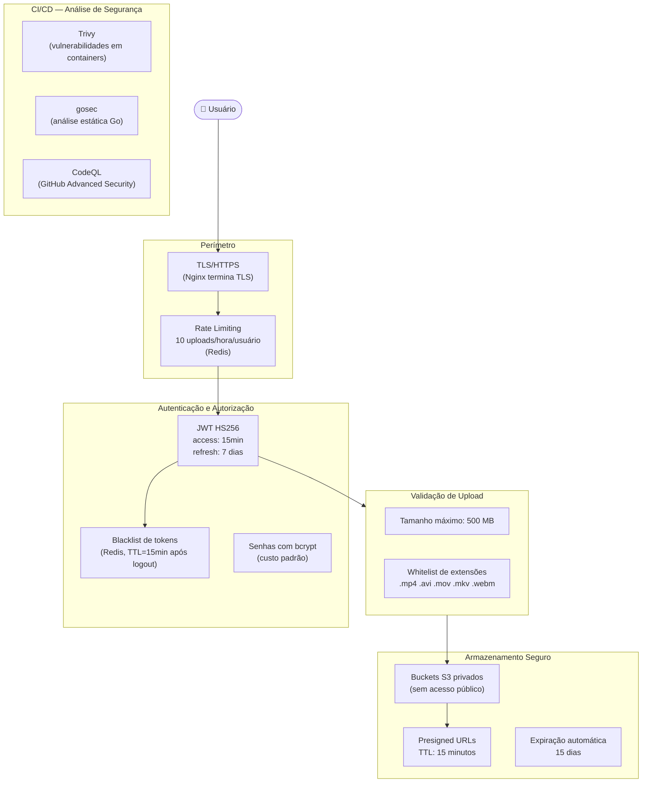

# Arquitetura da Plataforma de Processamento de Vídeo

## Sumário

1. [Visão Geral do Sistema](#1-visão-geral-do-sistema)
2. [Estilo Arquitetural](#2-estilo-arquitetural)
3. [Contexto do Sistema — C4 Nível 1](#3-contexto-do-sistema--c4-nível-1)
4. [Mapa de Serviços — C4 Nível 2](#4-mapa-de-serviços--c4-nível-2)
5. [Padrões de Comunicação](#5-padrões-de-comunicação)
6. [Fluxo de Processamento de Vídeo](#6-fluxo-de-processamento-de-vídeo)
7. [Fluxo de Autenticação](#7-fluxo-de-autenticação)
8. [Modelo de Dados](#8-modelo-de-dados)
9. [Bibliotecas Compartilhadas](#9-bibliotecas-compartilhadas)
10. [Infraestrutura e Monitoramento](#10-infraestrutura-e-monitoramento)
11. [Considerações de Escalabilidade](#11-considerações-de-escalabilidade)
12. [Arquitetura de Segurança](#12-arquitetura-de-segurança)

---

## 1. Visão Geral do Sistema

A **Plataforma de Processamento de Vídeo** é um sistema de microserviços orientado a eventos que permite que usuários façam upload de arquivos de vídeo, processem-nos automaticamente para extração de frames via FFmpeg e façam download dos frames como um arquivo ZIP. O sistema é projetado para ser escalável horizontalmente, resiliente a falhas e observável em produção.

**Principais capacidades:**

- Upload seguro de vídeos (até 500 MB, formatos `.mp4`, `.avi`, `.mov`, `.mkv`, `.webm`)
- Extração assíncrona de frames a 1 FPS via FFmpeg, executada por workers escaláveis
- Criação de arquivo ZIP com todos os frames extraídos
- Notificação por e-mail ao término do processamento (sucesso ou falha)
- Download dos frames via presigned URL do S3 (sem tráfego pelos serviços)
- Expiração e limpeza automática dos dados após 15 dias
- Observabilidade completa com Prometheus, Grafana e Alertmanager

**Stack tecnológica:**

| Camada | Tecnologia |
|---|---|
| Backend | Go 1.24+, Chi Router, Uber FX, GORM |
| Frontend | React 18, TypeScript, Vite, TanStack Router/Query, shadcn/ui, Bun |
| Banco de dados | PostgreSQL 15 (3 schemas) |
| Cache / Sessão | Redis 7 |
| Mensageria | RabbitMQ 3 (AMQP) |
| Armazenamento | AWS S3 (2 buckets) |
| Infraestrutura | Docker Compose, Nginx |
| Monitoramento | Prometheus, Grafana, Alertmanager |
| CI/CD | GitHub Actions, ghcr.io |

---

## 2. Estilo Arquitetural

O sistema adota dois padrões arquiteturais complementares: **Microserviços** no nível do sistema e **Clean Architecture (Hexagonal)** no nível de cada serviço.

### Microserviços

Cada serviço é um processo independente com banco de dados lógico próprio (schema separado no PostgreSQL), implantado em container Docker. Os serviços se comunicam via REST/HTTP para operações síncronas e via RabbitMQ para processamento assíncrono. Nenhum serviço acessa o schema do outro diretamente.

### Clean Architecture por Serviço

Todos os serviços Go seguem uma estrutura de camadas com dependências apontando sempre para dentro (ver [ADR-001](docs/adr/ADR-001-clean-architecture.md)):

```
┌─────────────────────────────────────┐
│           Infrastructure            │  ← GORM, S3, RabbitMQ, SMTP, Redis
├─────────────────────────────────────┤
│           Controllers               │  ← HTTP handlers, AMQP consumers
├─────────────────────────────────────┤
│           Use Cases                 │  ← Regras de negócio
├─────────────────────────────────────┤
│     Domain (Entities + Ports)       │  ← Interfaces e entidades puras
└─────────────────────────────────────┘
         Dependências ↑ apenas
```

O **Domain** não importa nenhum pacote externo. As **Use Cases** dependem apenas do Domain. A **Infrastructure** implementa as interfaces (ports) definidas no Domain. Esta estrutura garante que a lógica de negócio seja testável sem infraestrutura, resultando em cobertura média de **87,7%** de testes entre todos os serviços.

A injeção de dependência é gerenciada pelo **Uber FX** ([ADR-006](docs/adr/ADR-006-uber-fx-dependency-injection.md)), que valida o grafo completo de dependências na inicialização e orquestra o desligamento gracioso na ordem inversa.

---

## 3. Contexto do Sistema — C4 Nível 1

Visão de alto nível: quem usa o sistema e com quais sistemas externos ele se integra.



---

## 4. Mapa de Serviços — C4 Nível 2

Visão detalhada de todos os containers, suas responsabilidades, portas e dependências.



---

## 5. Padrões de Comunicação

O sistema utiliza dois padrões de comunicação distintos, cada um aplicado conforme a natureza da operação.



**Regras de decisão:**

| Critério | REST/HTTP | RabbitMQ AMQP |
|---|---|---|
| Tempo de resposta | Imediato (necessário) | Deferível |
| Operação | Curta (< 1s) | Longa (processamento FFmpeg) |
| Acoplamento | Direto | Desacoplado |
| Exemplos | Login, upload (resposta 202), download | Processamento, notificação |

---

## 6. Fluxo de Processamento de Vídeo

Sequência completa desde o upload até o download do arquivo ZIP.



**Ciclo de vida do status no banco de dados:**



---

## 7. Fluxo de Autenticação

Ciclo de vida completo de tokens JWT com blacklist no Redis.



---

## 8. Modelo de Dados

O banco de dados `video_platform` é dividido em três schemas. Foreign keys cruzam schemas para manter integridade referencial com mínimo acoplamento entre serviços.



**Índices relevantes:**

| Tabela | Índice | Colunas | Tipo |
|---|---|---|---|
| `videos.videos` | `idx_videos_user_status` | `(user_id, status)` | Composto |
| `videos.videos` | `idx_videos_created_at` | `(created_at)` | Simples |
| `videos.videos` | `idx_videos_expires_at` | `(expires_at) WHERE status='COMPLETED'` | Parcial |
| `notifications.notification_log` | `idx_notifications_user_id` | `(user_id)` | Simples |
| `notifications.notification_log` | `idx_notifications_video_id` | `(video_id)` | Simples |
| `notifications.notification_log` | `idx_notifications_status` | `(status)` | Simples |

**Enumerações e restrições:**

- `videos.status`: `CHECK IN ('PENDING', 'PROCESSING', 'COMPLETED', 'FAILED')`
- `notifications.type`: `CHECK IN ('EMAIL', 'WEBHOOK')`
- `notifications.status`: `CHECK IN ('PENDING', 'SENT', 'FAILED')`
- `videos.expires_at`: `DEFAULT CURRENT_TIMESTAMP + INTERVAL '15 days'`
- `videos.fps`: `DEFAULT 1`
- `notifications.video_id`: `ON DELETE SET NULL` (preserva log mesmo se vídeo for deletado)
- `auth.refresh_tokens.user_id`: `ON DELETE CASCADE`
- `videos.videos.user_id`: `ON DELETE CASCADE`

---

## 9. Bibliotecas Compartilhadas

O módulo `shared/` é referenciado localmente por todos os serviços via Go Workspace (`go.work`), eliminando a necessidade de publicar versões ([ADR-005](docs/adr/ADR-005-go-workspace-monorepo.md)). Mudanças propagam imediatamente para todos os serviços.

| Pacote | Responsabilidade | Serviços |
|---|---|---|
| `shared/pkg/config` | Carrega 50+ variáveis de ambiente (DB, JWT, AWS, SMTP, Redis, RabbitMQ) | Todos |
| `shared/pkg/database/postgres` | Conexão GORM com pool (25 max open, 5 idle, lifetime 5min) | Auth, Gateway, Worker, Notification |
| `shared/pkg/database/redis` | Cliente Redis para blacklist JWT, cache e rate limiting | Auth, Gateway |
| `shared/pkg/messaging/rabbitmq` | Publisher e Consumer AMQP — JSON persistente, prefetch=1, ack/nack manual | Gateway, Worker, Notification |
| `shared/pkg/auth/jwt` | Geração e validação de tokens HS256 + middleware HTTP Chi | Auth, Gateway |
| `shared/pkg/storage/s3` | Upload, download, multipart, presigned URL, listagem e deleção de objetos | Gateway, Worker, Storage |
| `shared/pkg/httpclient` | Cliente HTTP com retry automático (3×, timeout 30s) | Gateway, Worker |
| `shared/pkg/rest` | Helpers de resposta HTTP padronizados `{data, message, error}` | Todos os serviços HTTP |
| `shared/pkg/logging` | Logging estruturado em JSON com tag do serviço | Todos |
| `shared/pkg/metrics` | Métricas Prometheus + middleware HTTP para coleta automática | Todos |

---

## 10. Infraestrutura e Monitoramento

### Stack de Observabilidade



### Dashboards Grafana

| Dashboard | Painéis Principais |
|---|---|
| **System Overview** | Taxa de requisições HTTP por serviço, taxa de erros 5xx, latência P95, requests in-flight, status up/down |
| **Video Processing** | Profundidade da fila RabbitMQ, taxa de processamento (sucesso/falha), duração P95 por operação, vídeos por status, taxa de frames extraídos, taxa de e-mails enviados |
| **Database Health** | Taxa de queries por serviço/operação, duração P95 de queries, conexões abertas, conexões ativas no PostgreSQL, uso de memória Redis, taxa de comandos Redis |
| **Infrastructure** | CPU por instância, memória por instância, uso de disco, I/O de rede (RX/TX), CPU de container, memória de container |

### Regras de Alerta

| Alerta | Condição | Duração | Severidade |
|---|---|---|---|
| `ServiceDown` | Qualquer serviço monitorado com `up == 0` | 2 min | **Critical** |
| `DiskSpaceLow` | Espaço livre em disco `< 10%` | 5 min | **Critical** |
| `HighHTTPErrorRate` | Taxa de respostas 5xx `> 5%` | 5 min | Warning |
| `HighRequestLatency` | Latência P95 `> 2s` | 5 min | Warning |
| `HighQueueDepth` | Mensagens pendentes na fila `> 1.000` | 10 min | Warning |
| `DatabaseConnectionPoolNearlyExhausted` | Pool de conexões `> 80%` usado | 5 min | Warning |
| `HighVideoProcessingFailureRate` | Taxa de falhas no processamento `> 10%` | 10 min | Warning |
| `HighEmailFailureRate` | Taxa de falhas no envio de e-mail `> 20%` | 5 min | Warning |
| `HighCPUUsage` | Uso de CPU `> 80%` | 10 min | Warning |
| `HighMemoryUsage` | Uso de memória `> 85%` | 5 min | Warning |

Alertas críticos são enviados imediatamente com prefixo `[CRITICAL]`; warnings são agrupados com `group_wait: 10s` e repetidos a cada 12h.

### Cleanup Cron

O job de limpeza é executado diariamente às **02:00 UTC** via [supercronic](https://github.com/aptible/supercronic) (cron seguro para containers):

1. Consulta `videos.videos WHERE expires_at < NOW()`
2. Para cada vídeo expirado: deleta o arquivo original do bucket `uploads`, os frames e o ZIP do bucket `processed`
3. Deleta o registro do PostgreSQL (cascade deleta os logs de notificação)
4. Registra contadores: vídeos deletados, objetos S3 removidos, duração da execução
5. Suporta modo `--dry-run` para validação sem deleção real

---

## 11. Considerações de Escalabilidade

### Escalabilidade Horizontal



**Por que os serviços são stateless:**

- Nenhum serviço armazena estado em memória entre requisições
- Sessões são representadas por JWT (validados localmente) + Redis (blacklist)
- Jobs são distribuídos pelo RabbitMQ com prefetch=1 (um job por worker por vez)
- Arquivos são armazenados no S3, não em disco local

**Gargalos e estratégias:**

| Componente | Estratégia de Escala |
|---|---|
| Processing Worker | Aumentar réplicas (Docker: `deploy.replicas`, K8s: HPA por profundidade da fila) |
| API Gateway | Réplicas stateless atrás de load balancer |
| PostgreSQL | Read replicas para queries de leitura; PgBouncer para pooling |
| S3 | Elasticidade automática da AWS |
| RabbitMQ | Clustering para alta disponibilidade |

---

## 12. Arquitetura de Segurança

O sistema implementa defesa em profundidade com múltiplas camadas de segurança.



**Resumo das camadas de defesa:**

| Ameaça | Controle |
|---|---|
| Senhas fracas / vazamento | `bcrypt` com custo padrão; apenas o hash é armazenado |
| Tokens roubados | Access token expira em 15min; logout invalida imediatamente via Redis blacklist |
| Abuso de upload | Rate limiting (10/hora/usuário via Redis); limite de 500 MB; whitelist de extensões |
| Upload de arquivos maliciosos | Whitelist de extensões (.mp4, .avi, .mov, .mkv, .webm) |
| Exposição de credenciais AWS | Downloads via presigned URL (TTL 15min); buckets S3 totalmente privados |
| Dados retidos indefinidamente | Expiração automática após 15 dias + cleanup cron diário |
| Vulnerabilidades em dependências | Trivy (containers) + gosec (Go) + CodeQL em cada PR |

---

*Decisões arquiteturais detalhadas estão documentadas nos [ADRs](docs/adr/).*
